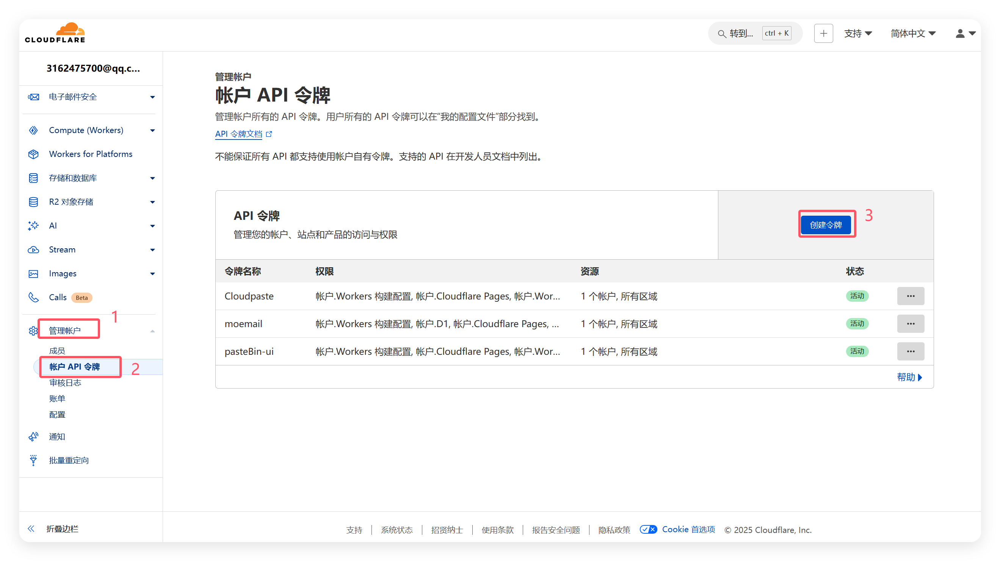
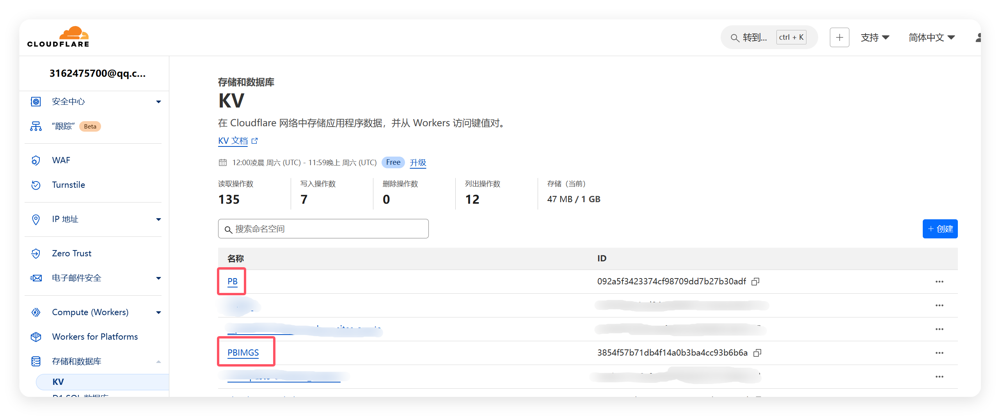
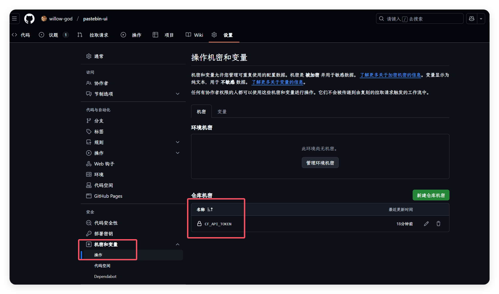
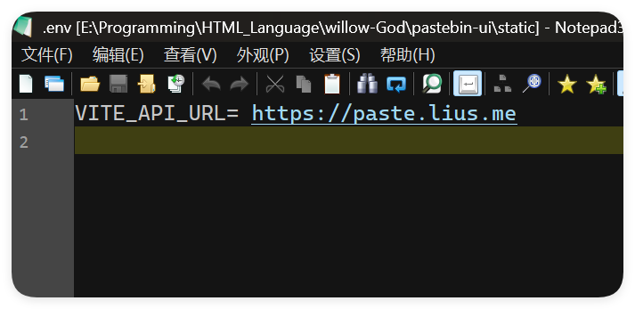
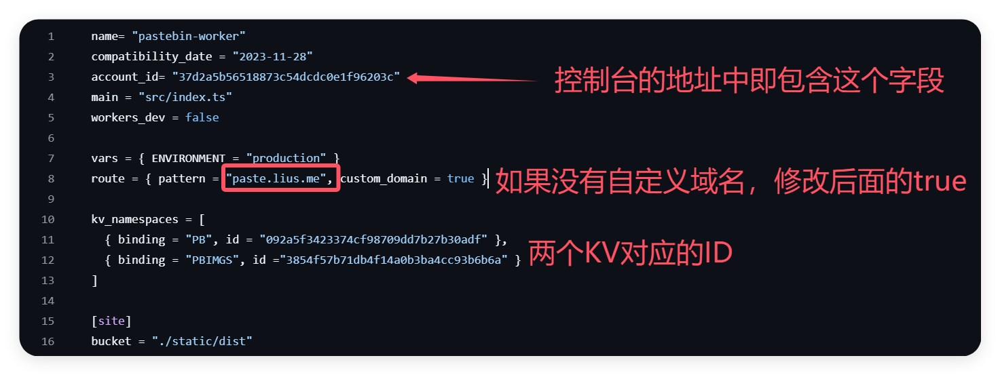
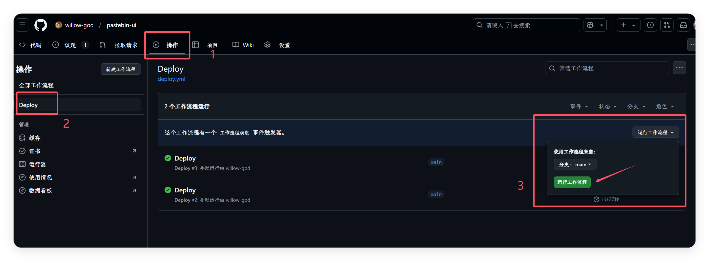

# Pastebin-ui

This is a lightweight content relay station project based on Cloudflare Workers and KV, ideal for developers who need a simple and efficient solution for content storage. It does not rely on R2 buckets, is easy to deploy, and is suitable for small-scale projects.

This project is extracted from a historical version of the original project as I found it useful. It is open-sourced under the original project's license. If there are any infringement issues, please contact me for removal.

Original project repository: [Pastebin Worker - Historical Version](https://github.com/xiadd/pastebin-worker)

## Deployment Documentation

### 1. Manual Deployment (Recommended)

#### Obtain Cloudflare API Token

1. Log in to [Cloudflare Dashboard](https://dash.cloudflare.com/).
2. Click on your profile icon in the top-right corner and select **My Profile**.
3. Go to the **API Tokens** page.
4. Click `Create Token` and choose the `Edit Cloudflare Workers` template.
5. Configure and create the token, then copy the generated API Token.



#### Create KV Storage

1. Log in to [Cloudflare Dashboard](https://dash.cloudflare.com/).
2. Click on **Storage & Database** in the left menu and select `KV`.
3. Create two `KV` namespaces named `PB` and `PBIMGS`.
4. Save the `IDs` for later use.



#### Set Secrets in GitHub Actions

1. Open your project repository on GitHub.
2. Navigate to **Settings > Secrets and variables > Actions**.
3. Click `New repository secret`.
4. Set the name as `CF_API_TOKEN` and the value as your generated API Token.



#### Configure Environment Variables

1. Set the frontend environment variables in `./static/.env`:
   ```env
   VITE_API_BASE_URL=<Your Cloudflare Worker Deployment URL>
   ```
2. Ensure this URL is added to Cloudflare DNS, as it will be automatically resolved.



#### Modify Worker Configuration File

1. Update the following variables in `./wrangler.toml`:



#### Deploy to Cloudflare

- Every push to the `main` branch will automatically trigger the deployment workflow via GitHub Actions.
- To manually trigger a deployment:
  1. Open the GitHub Actions page.
  2. Find the appropriate Action and click `Run workflow`.



### 2. Local Development Deployment (DEV)

#### Configure Cloudflare Workers KV Namespace

1. Log in to [Cloudflare Dashboard](https://dash.cloudflare.com/).
2. Create two KV namespaces:
   - One for storing files (named `PBIMG`).
   - One for storing text (named `PB`).
3. Save their `IDs` for later use.

#### Update `wrangler.toml`

```toml
name = "pastebin-worker"
compatibility_date = "2023-11-28"
account_id = "<Your account_id>"
main = "src/index.ts"
workers_dev = false

vars = { ENVIRONMENT = "production" }
route = { pattern = "<Your Domain>", custom_domain = true }

kv_namespaces = [
  { binding = "PB", id = "<PB kv id>" },
  { binding = "PBIMGS", id = "<PBIMG kv id>" }
]

[site]
bucket = "./static/dist"
```

- `account_id` can be found in your Cloudflare Dashboard profile.
- If you are not using a custom domain, comment out the `route` line.

### Start the Service

#### Start Backend

```bash
npm i @cloudflare/wrangler -g
wrangler login
wrangler dev
```

#### Start Frontend

```bash
cd static
yarn install
yarn dev
```

After starting:
- Backend address: `http://localhost:8787`
- Frontend address: `http://localhost:5173`

#### Test Frontend Build

Run the following in the `static` directory:

```bash
yarn build
```

Access `http://localhost:8787` to view the built frontend.

## Development Documentation

### Environment Initialization

1. Install Wrangler CLI:

   ```bash
   npm i @cloudflare/wrangler -g
   ```

2. Log in to your Cloudflare account:

   ```bash
   wrangler login
   ```

3. Verify login:

   ```bash
   wrangler whoami
   ```

   Your username should appear if the login is successful.

### Install Dependencies

#### Backend Dependencies

```bash
yarn install
```

#### Frontend Dependencies

```bash
cd static
yarn install
```

### Configuration Files

Refer to [Deployment Documentation](#configure-cloudflare-workers-kv-namespace) for setting up `wrangler.toml` and `.env` files.

### Start Development Environment

Follow the instructions in [Start the Service](#start-the-service) to run the backend and frontend.

### Testing

- Access `http://localhost:5173` locally to test the frontend.
- Backend API address: `http://localhost:8787`.

### Deploy to Cloudflare

Refer to [Deployment Documentation](#deployment-documentation).

